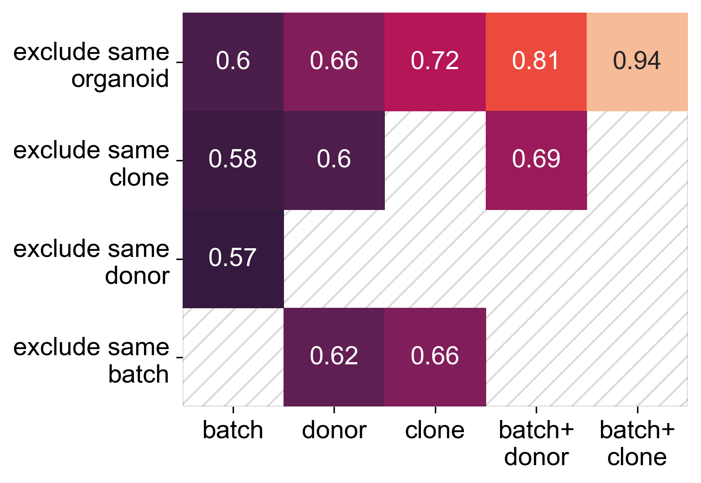

# Rank-To-Group (RTG) score evaluates contribution of confounders



Batch, cell line, donor, plate, reprogramming, protocol --- these and other confounding factors influence cell cultures in vitro.

RTG score tracks contribution of different factors to variability 
by estimating how Rank maps to Group. 
Scoring relies on ranking by similarity, so there is no explicit or implicit assumption of linearity.

RTG perfectly works with both well-interpretable data (gene expressions, cell types) 
and embeddings provided by deep-learning.

## Usage 

`rtg_score` is python package. Installation:
```bash
pip install rtg_score
```

RTG score requires two DataFrames: one with confounds and ane with embeddings (or other features, e.g. gene expressions)
```python
from rtg_score import compute_RTG_score
# following code corresponds to computing element of the figure above
# 
score = compute_RTG_score(
    metadata=confounders_metadata,
    include_confounders=['batch', 'donor'],
    exclude_confounders=['organoid_id'],
    embeddings=qpcr_delta_ct, 
)
```

An example of code to compute and plot table above is available in [`example`](https://github.com/System1Bio/rtg_score/blob/master/example/Example_qPCR.ipynb) subfolder.


      